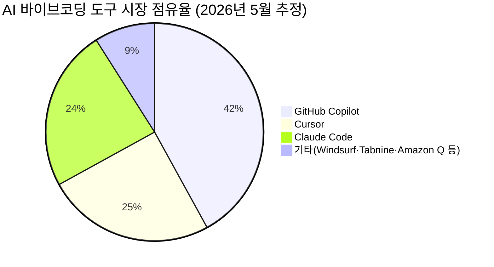
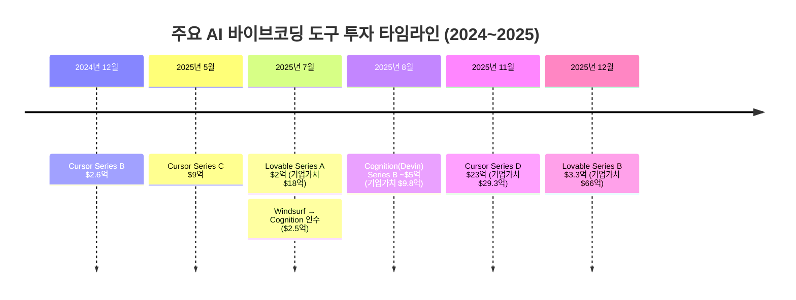

# AI 바이브코딩 도구 시장 현황 및 2027년 전망

> **작성일**: 2026년 5월 7일  
> **분류**: 시장 조사 / 기술 트렌드 리포트  
> **대상 독자**: 개발자, 1인 창업자, AI 도구 관심자

---

## 1. 바이브코딩이란 무엇인가?

"코드를 완전히 AI에 맡기고, 흐름(Vibe)에 올라타라."

**바이브코딩(Vibe Coding)**은 2025년 2월 OpenAI 공동창업자 **Andrej Karpathy**가 처음 제안한 개념이다. 개발자가 자연어로 의도를 표현하면, AI가 실행 가능한 코드로 변환해주는 방식으로, 엄밀한 사전 설계 없이 AI가 생성한 코드를 실행·테스트하며 반복하는 개발 철학이다. 이 개념은 빠르게 확산되어 2025년 **Collins English Dictionary 올해의 단어**로 선정됐고, Merriam-Webster도 같은 해 3월 트렌딩 표현으로 등록했다.

### 바이브코딩 vs 일반 AI 코딩 비교

| 특성 | 바이브코딩 | 일반 AI 코딩 보조 |
|------|-----------|-----------------|
| 개발 철학 | 몰입감(Vibe) 우선, 직관적 흐름 | 자동완성·제안 중심 |
| 사전 설계 | 최소화 | 상세한 설계 필요 |
| AI 역할 | 전체 구현 담당 | 보조 및 제안 |
| 작업 단위 | 멀티 파일·대규모 작업 | 개별 코드 라인/함수 |
| 대표 도구 | Cursor Composer, Claude Code Agent | GitHub Copilot(기본), Tabnine |

> 출처: [Wikipedia — Vibe coding](https://en.wikipedia.org/wiki/Vibe_coding), [What Is Vibe Coding? (vibecoding.app)](https://vibecoding.app/blog/what-is-vibe-coding)

---

## 2. 2026년 5월 현재 인기 도구 순위

### 2-1. 시장 점유율 (에디터 기반 AI 어시스턴트)

### 2-2. 주요 도구 상세 비교표

| 도구 | 운영사 | 유료 사용자 | ARR | 월 가격 | 핵심 강점 |
|------|--------|------------|-----|---------|----------|
| **GitHub Copilot** | Microsoft | 470만+ (전체 2000만) | - | $10 | 엔터프라이즈·멀티 IDE, Fortune 100 기업 90% 채택 |
| **Cursor** | Anysphere | 100만+ | $20억 | $20 | 대규모 코드베이스, 멀티파일 편집, 에이전트 모드 |
| **Claude Code** | Anthropic | - | - | API 종량제 | SWE-bench 80.8% 1위, 100만 토큰 컨텍스트 |
| **Windsurf** | Cognition | 100만 | $8,200만 | $15 | 깔끔한 UX, 예측 가능한 동작, 멀티 저장소 |
| **Lovable** | Lovable | - | - | Freemium | MVP 풀스택 빌더, 비개발자 대상 |
| **Bolt.new** | StackBlitz | - | - | Freemium | 전체 앱 스캐폴딩, 프론트/백엔드/DB |
| **Replit** | Replit | - | - | $25 | Agent 3: 최대 200분 자율 작업 |
| **v0.dev** | Vercel | - | - | Freemium | React 컴포넌트 특화, 프론트엔드 UI 빌더 |

### 2-3. 도구 카테고리 분류

**에디터 기반 AI 어시스턴트** (전문 개발자용)
- Cursor, Windsurf, GitHub Copilot, Claude Code, Tabnine, Amazon Q

**풀스택 바이브코딩 빌더** (비개발자·빠른 프로토타입용)
- Lovable, Bolt.new, Replit

**전문 특화 도구**
- v0.dev (React/프론트엔드), Base44 (균형형)

> 출처: [TechRadar — Best Vibe Coding Tools 2026](https://www.techradar.com/pro/best-vibe-coding-tools), [DataCamp — Top Vibe Coding Tools](https://www.datacamp.com/blog/top-vibe-coding-tools-to-build-faster), [roadmap.sh — Best Vibe Coding Tools](https://roadmap.sh/vibe-coding/best-tools)

---

## 3. 투자·기업가치 현황 (2025~2026)

글로벌 VC 투자의 **61%**가 AI 분야에 집중되면서(2025년 기준, 총 $258.7억), AI 바이브코딩 도구는 가장 뜨거운 투자처로 부상했다.

### 주요 기업 투자 유치 현황

| 기업 | 최근 라운드 | 투자금 | 기업가치 | 주요 투자자 |
|------|-----------|--------|---------|-----------|
| **Cursor (Anysphere)** | Series D (2025.11) | $23억 | **$29.3억** | a16z, Thrive Capital, NVIDIA |
| **Lovable** | Series B (2025.12) | $3.3억 | **$66억** | - |
| **Cognition (Devin+Windsurf)** | Series B (2025.08) | ~$5억 | **$9.8억** | - |

**Cursor의 폭발적 성장**: ARR $10억 → $20억으로 단 3개월 만에 2배 성장(2025년 11~2026년 2월). 현재 $50억 기업가치 목표로 $20억 추가 유치 협상 중.

> 출처: [CNBC — Cursor $2.3B Funding](https://www.cnbc.com/2025/11/13/cursor-ai-startup-funding-round-valuation.html), [The Next Web — Cursor $50B Valuation](https://thenextweb.com/news/cursor-anysphere-2-billion-funding-50-billion-valuation-ai-coding), [OECD — VC Investments in AI](https://www.oecd.org/en/publications/venture-capital-investments-in-artificial-intelligence-through-2025_a13752f5-en/full-report.html)

---

## 4. 개발자 채택 통계

*(이미지: 성장 곡선 개념도)*

- **92%** — 미국 개발자의 일일 AI 코딩 도구 사용률 (2026년)
- **41%** — 전 세계 코드 중 AI 생성 비율, 2026년 말 **60%** 예상 (Gartner)
- **84%** — AI 코딩 도구를 적극 사용 또는 도입 예정인 개발자 비율 (Stack Overflow Survey)
- **63%** — 바이브코딩 사용자 중 비개발자 비율 (빠른 대중화 진행)
- **87%** — Fortune 500대 기업 중 최소 1개 바이브코딩 플랫폼 운영
- **21%** — Y Combinator Winter 2025 코호트 중 AI 코드 비중 91% 이상인 스타트업

엔터프라이즈 채택률: 2023년 10% 미만 → 2024년 14% → **2028년 90% 예상**

> 출처: [Taskade — State of Vibe Coding 2026](https://www.taskade.com/blog/state-of-vibe-coding), [Second Talent — Vibe Coding Statistics 2026](https://www.secondtalent.com/resources/vibe-coding-statistics/), [Infobip — AI and the Future of Coding](https://www.infobip.com/developers/blog/ai-hiring-and-the-future-of-coding-what-the-top-2026-predictions-mean-for-developers)

---

## 5. 시장 예측 — 2027년까지 시나리오 분석

**시장 규모 전망**: $4.7B(2025) → **$12.3B(2027)**, CAGR ~27%

> 출처: [Grand View Research — AI Code Tools Market](https://www.grandviewresearch.com/industry-analysis/ai-code-tools-market-report), [Verdict — Vibe Coding Mainstream 2026](https://www.verdict.co.uk/vibe-coding-mainstream-in-2026/)

### 시나리오 A: Cursor 독주 (가능성 20%)

Cursor가 현재 ARR 성장세($20억)와 $50억 목표 기업가치를 유지하며 업계 표준 에디터로 자리잡는 시나리오. 단, Microsoft(Copilot)와 Anthropic(Claude Code)의 자원 규모를 고려하면 단독 독주는 쉽지 않다.

### 시나리오 B: 3강 구도 — GitHub Copilot + Cursor + Claude Code (가능성 60%, 최유력)

각 도구가 다른 사용자층을 점유하는 **세분화 시장** 구도다.
- **GitHub Copilot**: 엔터프라이즈·대기업 개발팀 (안정성·보안·MS 생태계)
- **Cursor**: 고성능 추구 개인·스타트업 개발자 (최신 AI 성능)
- **Claude Code**: 터미널 중심 워크플로우, 복잡한 추론 작업

이 구도는 "Winner-Take-All이 아닌 세분화 시장"이라는 업계 전문가들의 중론과 일치한다.

### 시나리오 C: 대형 M&A 통합 (가능성 20%)

2026~2027년은 개발자 도구 역사상 **최대 M&A 사이클** 예상. 독자적 AI 모델·방어적 사용자 기반 없는 소형 플레이어(소규모 바이브코딩 빌더)는 인수 또는 폐업. Windsurf의 Cognition 인수($2.5억)가 그 신호탄.

### 최종 예측: **시나리오 B (3강 구도)**가 가장 유력

단일 승자보다는 세 축이 시장을 분할하되, **Cursor가 성능 지표에서 선도**, **GitHub Copilot이 기업 채택에서 우위**, **Claude Code가 고급 추론 작업에서 특화**하는 구도가 2027년까지 지속될 가능성이 높다.

> 출처: [CodeAnt — Cursor vs Windsurf vs Copilot 2026](https://www.codeant.ai/blogs/best-ai-code-editor-cursor-vs-windsurf-vs-copilot), [Tech Monitor — Vibe Coding Mainstream 2026](https://www.techmonitor.ai/analysis/vibe-coding-will-become-mainstream-in-2026), [Medium — GitHub Copilot vs Claude Code vs Cursor 2026](https://medium.com/@kanerika/github-copilot-vs-claude-code-vs-cursor-vs-windsurf-2026-c54f8a5cc051)

---

## 6. 한국 시장 특이점

한국은 **1인 창업 문화**와 바이브코딩이 결합되며 독특한 생태계를 형성하고 있다.

- **조코딩(JoCoding, 조동근)**: 유튜브 68만 구독자를 보유한 대표 AI 코딩 교육자. "AI 시대 1인 창업은 현실"이라는 메시지로 바이브코딩 대중화를 주도. 바이브코딩 기반 1인 창업 부트캠프 운영 중.  
  출처: [AI Times — 조코딩 인터뷰](https://www.aitimes.com/news/articleView.html?idxno=203434)

- **Cursor Korea 커뮤니티**: [cursorkorea.org](https://cursorkorea.org/)에서 질문·팁·프롬프트·쇼케이스를 공유하는 공식 한국 사용자 커뮤니티 활성화.

- **KOCSEA 바이브코딩 캠프**: 한인 과학기술자 협회(KOCSEA)가 바이브코딩 겨울캠프를 운영하며 교육 저변 확대.

- **비개발자 진입 급증**: 한국에서도 디자이너·마케터·기획자가 Lovable·Bolt.new로 MVP를 직접 빌드하는 사례 증가.

---

## 7. 주요 리스크 및 주의사항

| 리스크 | 내용 | 출처 |
|--------|------|------|
| 보안 취약점 | AI 생성 코드의 45%가 보안 테스트 실패 (Veracode 2025) | [Veracode GenAI Report](https://www.veracode.com) |
| 기술 부채 증가 | "2026 = 기술 부채의 해" — AI 채택이 레거시 부채에 추가 부담 | [Salesforce Ben — 2026 Predictions](https://www.salesforceben.com/2026-predictions-its-the-year-of-technical-debt-thanks-to-vibe-coding/) |
| 속도 역설 | 경험 많은 개발자가 AI 도구 사용 시 실제론 19% 더 오래 걸림 (METR 2025.7 연구) | [Harvard Gazette](https://news.harvard.edu/gazette/story/2026/04/vibe-coding-may-offer-insight-into-our-ai-future/) |
| 과도한 의존 | AI 사용 개발자들이 보안 코드 작성 능력 저하 경향 | [Appwrite — Comparing Vibe Coding Tools](https://appwrite.io/blog/post/comparing-vibe-coding-tools) |

---

## 8. 결론

2026년 5월 현재, **AI 바이브코딩은 더 이상 유행어가 아닌 산업 표준**이 되고 있다. 미국 개발자 92%의 일일 사용, 전 세계 코드의 41%가 AI 생성이라는 수치가 이를 입증한다.

**도구별 포지션**은 명확히 분화되고 있다 — 엔터프라이즈는 GitHub Copilot, 성능 추구 개발자는 Cursor, 복잡 추론은 Claude Code, 비개발자 창업자는 Lovable·Bolt.new. 2027년까지 단일 독주자보다 이 **3~4강 분할 구도**가 유지될 가능성이 가장 높다.

한국에서는 조코딩 같은 교육자 주도 하에 **1인 창업 + 바이브코딩** 문화가 빠르게 성장 중이며, 비개발자의 창업 장벽이 역대 최저 수준으로 낮아지고 있다.

---

## 출처 목록

1. [Wikipedia — Vibe coding](https://en.wikipedia.org/wiki/Vibe_coding)
2. [roadmap.sh — Best Vibe Coding Tools](https://roadmap.sh/vibe-coding/best-tools)
3. [Second Talent — Vibe Coding Statistics & Trends 2026](https://www.secondtalent.com/resources/vibe-coding-statistics/)
4. [Taskade — State of Vibe Coding 2026](https://www.taskade.com/blog/state-of-vibe-coding)
5. [TechRadar — Best Vibe Coding Tools 2026](https://www.techradar.com/pro/best-vibe-coding-tools)
6. [DataCamp — Top Vibe Coding Tools to Build Faster](https://www.datacamp.com/blog/top-vibe-coding-tools-to-build-faster)
7. [CodeAnt — Cursor vs Windsurf vs Copilot 2026](https://www.codeant.ai/blogs/best-ai-code-editor-cursor-vs-windsurf-vs-copilot)
8. [CNBC — Cursor AI Startup $2.3B Funding](https://www.cnbc.com/2025/11/13/cursor-ai-startup-funding-round-valuation.html)
9. [The Next Web — Cursor $50B Valuation](https://thenextweb.com/news/cursor-anysphere-2-billion-funding-50-billion-valuation-ai-coding)
10. [Grand View Research — AI Code Tools Market Report](https://www.grandviewresearch.com/industry-analysis/ai-code-tools-market-report)
11. [OECD — Venture Capital Investments in AI 2025](https://www.oecd.org/en/publications/venture-capital-investments-in-artificial-intelligence-through-2025_a13752f5-en/full-report.html)
12. [Tech Monitor — Vibe Coding Will Become Mainstream in 2026](https://www.techmonitor.ai/analysis/vibe-coding-will-become-mainstream-in-2026)
13. [Harvard Gazette — Vibe Coding and AI Future](https://news.harvard.edu/gazette/story/2026/04/vibe-coding-may-offer-insight-into-our-ai-future/)
14. [Salesforce Ben — 2026 기술 부채 예측](https://www.salesforceben.com/2026-predictions-its-the-year-of-technical-debt-thanks-to-vibe-coding/)
15. [AI Times — 조코딩 인터뷰](https://www.aitimes.com/news/articleView.html?idxno=203434)
16. [Cursor Korea — 한국 AI 코딩 커뮤니티](https://cursorkorea.org/)
17. [Appwrite — Comparing Vibe Coding Tools](https://appwrite.io/blog/post/comparing-vibe-coding-tools)
18. [Medium — GitHub Copilot vs Claude Code vs Cursor vs Windsurf 2026](https://medium.com/@kanerika/github-copilot-vs-claude-code-vs-cursor-vs-windsurf-2026-c54f8a5cc051)
19. [Verdict — Vibe Coding Mainstream 2026](https://www.verdict.co.uk/vibe-coding-mainstream-in-2026/)
20. [Infobip — AI, Hiring, and the Future of Coding 2026](https://www.infobip.com/developers/blog/ai-hiring-and-the-future-of-coding-what-the-top-2026-predictions-mean-for-developers)
